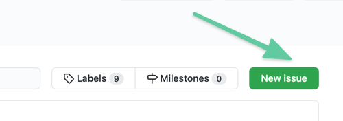
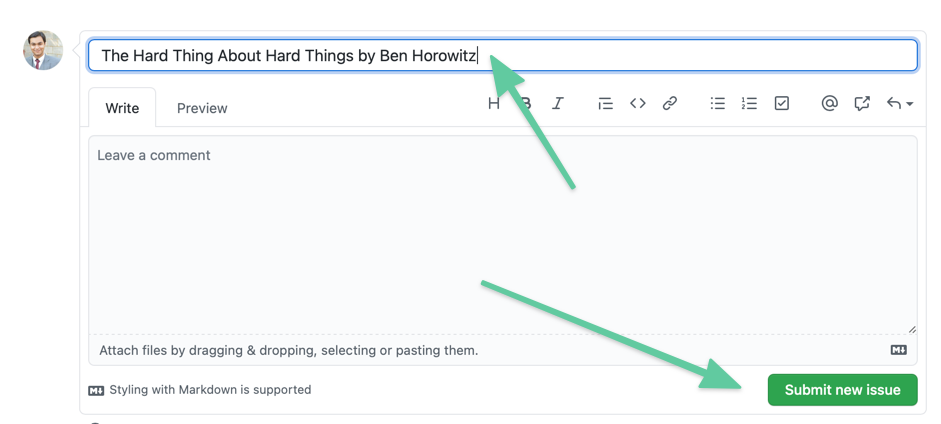
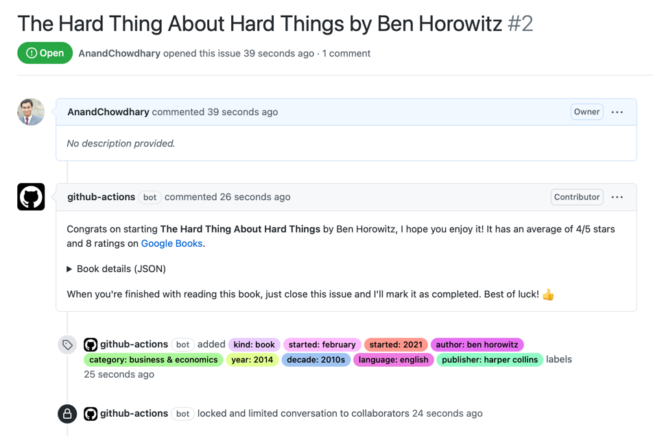
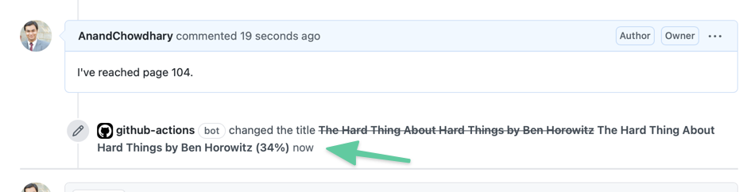
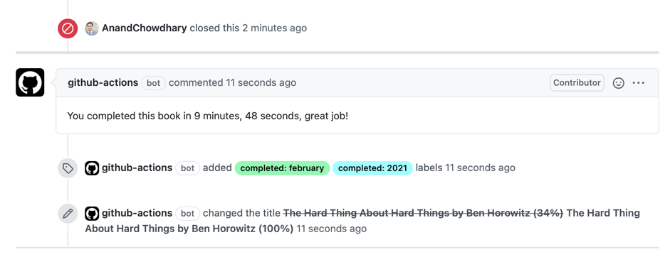
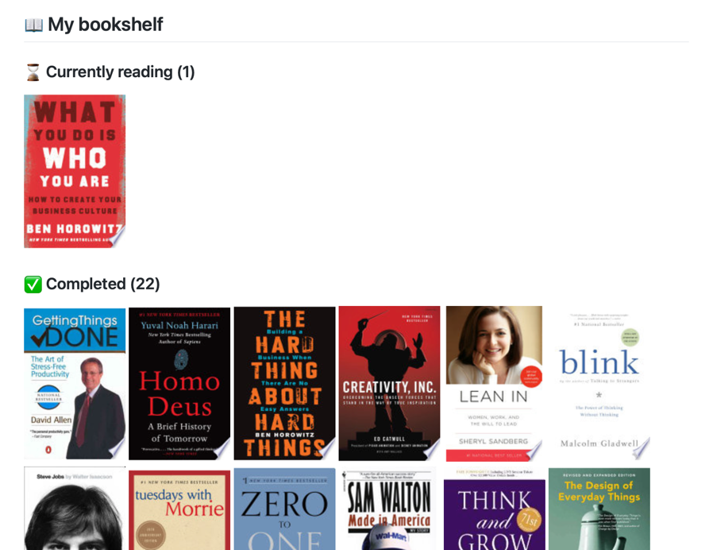

# 

Track your reading using repository issues and generate a README.md and open API automagically.

[**View starter repository →**](https://github.com/AnandChowdhary/books)

## ⭐ Features

- End-to-end automated workflow using GitHub issues:
  - Create GitHub issues to add the books you're reading
  - Track your reading progress by adding comments to the issue
  - Close the issue when you've completed the book
- Get a README.md summary and JSON API for your reading data
- Uses Google Books API to fetch details like cover and ISBN

### Get started

This repository only includes the GitHub Actions required as dependencies. To get started, [**visit AnandChowdhary/books**](https://github.com/AnandChowdhary/books) and use it as a starting point. You can use the [Use this template](https://docs.github.com/en/github/creating-cloning-and-archiving-repositories/creating-a-repository-from-a-template) button to create a new repository:

1. Go to [AnandChowdhary/books](https://github.com/AnandChowdhary/books)
2. Click on the "Use this template" button or fork the repository
3. Add a book by creating a new issue with the book's name

  
How to add a new book

First, create a new issue in your repository:

Then, write the name of the book and author as the issue title:

Lastly, press the "Submit new issue" button and you'll see a comment and labels added automatically:

  
How to update reading progress

In your book's issue, simply enter in plain text the progress. For example, "I've reached page 100" or "I've completed 24%", or "I've reached page 42/542". The issue title will be automatically updated to include your reading progress:

  
How to complete reading a book

When you've completed a book, simply close the issue. An automated comment will be added to tell you about your reading time and some new labels will be added.

  
How to add a book as "Want to read"

When creating a new issue for the book, add the label "want to read".

## 📖 Example

Simply create issues with names of books, and Bookshelf Action will automatically organize them with labels:

Additionally, a summary of your reading progress is generated in the `README.md` file:

## 📄 License

- Code: [MIT](./LICENSE) © [Anand Chowdhary](https://anandchowdhary.com)
- Books icon by [Francielly Costantin Senra](https://thenounproject.com/franciellycs/) from [The Noun Project](https://thenounproject.com)
- Merge icon by [Danil Polshin](https://thenounproject.com/everydaytemplate) from [The Noun Project](https://thenounproject.com)
- "GitHub" is a trademark of GitHub, Inc.
